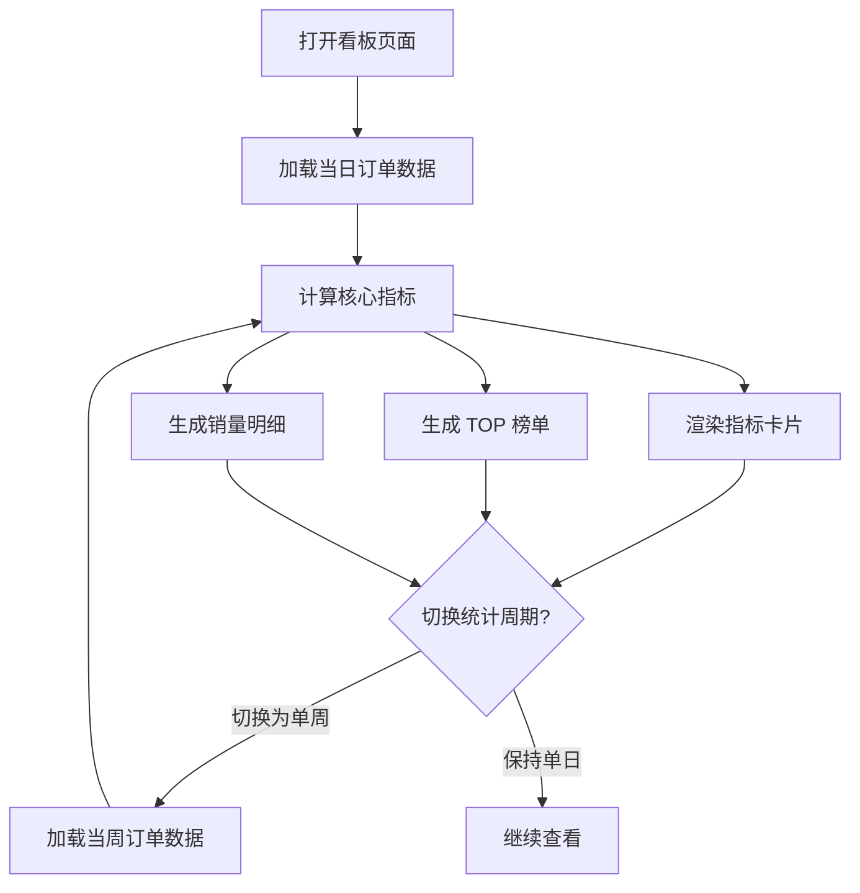

## 1. 产品概述

社区水果店每日销量统计看板——面向门店工作人员与管理人员，将每日成交订单原始数据聚合为直观的经营统计指标，支持按日/周切换查看，所有计算公式简单透明，方便纸质订单手工核对。

## 2. 核心功能

### 2.1 用户角色

| 角色 | 注册方式 | 核心权限 |
|------|----------|----------|
| 门店工作人员 | 无需注册 | 查看当日/当周销售统计 |
| 门店管理人员 | 无需注册 | 查看当日/当周销售统计、核对数据 |

### 2.2 功能模块

1. **统计看板页**：周期切换、核心指标卡片、销量 TOP 榜单、各类水果销量明细

### 2.3 页面详情

| 页面名称 | 模块名称 | 功能描述 |
|----------|----------|----------|
| 统计看板页 | 周期切换器 | 支持切换「单日」和「单周」两种统计周期，选择具体日期或周范围 |
| 统计看板页 | 核心指标卡片 | 展示当日/当周总销售额、总订单数、平均客单价三大核心指标 |
| 统计看板页 | 销量 TOP 榜单 | 按销售数量降序排列，展示 TOP 水果商品及对应销量和销售额 |
| 统计看板页 | 水果销量明细 | 展示所选周期内各类水果的销售数量与销售额汇总表 |

## 3. 核心流程

用户打开看板 → 默认展示当日统计数据 → 可切换为单周视图 → 查看核心指标、TOP 榜单、明细数据 → 手工核对纸质订单

## 4. 用户界面设计

### 4.1 设计风格

- 主色调：暖橙色（#FF6B35）象征新鲜水果活力，搭配深森林绿（#2D5016）传递自然有机感
- 辅助色：奶油白（#FFF8F0）背景、浅绿（#E8F5E9）卡片背景
- 按钮风格：圆角胶囊型，微阴影，hover 时轻微上浮
- 字体：数字使用等宽粗体增强数据可读性，标题使用圆润黑体
- 布局：顶部标题栏 + 周期切换 + 指标卡片区 + 榜单与明细双栏
- 图标风格：简约线条型水果图标，搭配 emoji 点缀

### 4.2 页面设计概览

| 页面名称 | 模块名称 | UI 元素 |
|----------|----------|----------|
| 统计看板页 | 顶部标题栏 | 店铺名称、日期显示、水果篮装饰插画 |
| 统计看板页 | 周期切换器 | 日/周切换标签页、日期选择器、周范围选择器 |
| 统计看板页 | 核心指标卡片 | 三张等宽卡片，大号数字 + 小号标签，带微型趋势箭头图标 |
| 统计看板页 | 销量 TOP 榜单 | 左侧卡片，排名序号 + 水果名称 + 横向柱状条 + 销量/销售额 |
| 统计看板页 | 水果销量明细 | 右侧表格，水果名称、销售数量、销售额、占比百分比 |

### 4.3 响应式设计

- 桌面优先设计，宽屏双栏布局（榜单 + 明细）
- 平板端保持双栏但适当压缩间距
- 移动端切换为单栏垂直堆叠布局

### 4.4 3D 场景指引

不适用
