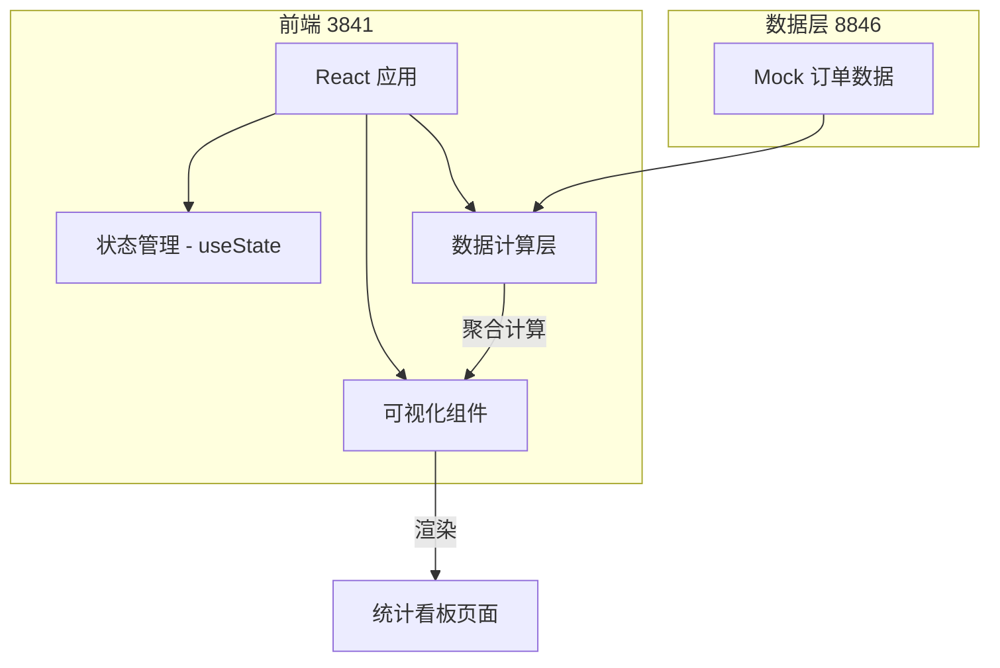
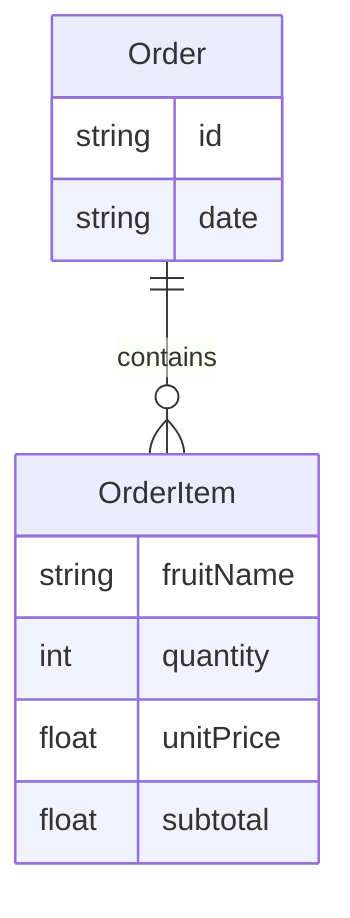

## 1. 架构设计



## 2. 技术说明

- 前端：React@18 + TailwindCSS@3 + Vite
- 初始化工具：Vite
- 后端：无（数据由 8846 聚合计算，本前端使用 Mock 数据模拟）
- 数据库：无（前端内置 Mock 订单数据集）

## 3. 路由定义

| 路由 | 用途 |
|------|------|
| / | 统计看板主页面，展示所有经营指标 |

## 4. API 定义

无后端 API，所有数据为前端 Mock。数据结构定义如下：

```typescript
interface Order {
  id: string
  date: string
  items: OrderItem[]
}

interface OrderItem {
  fruitName: string
  quantity: number
  unitPrice: number
  subtotal: number
}

interface DailyStats {
  date: string
  totalSales: number
  totalOrders: number
  avgOrderValue: number
  fruitStats: FruitStat[]
  topProducts: FruitStat[]
}

interface FruitStat {
  fruitName: string
  totalQuantity: number
  totalSales: number
  percentage: number
}
```

## 5. 服务器架构图

不适用（纯前端项目）

## 6. 数据模型

### 6.1 数据模型定义



### 6.2 数据定义语言

不适用（无数据库，使用前端 Mock 数据）

### 6.3 计算公式

- 总销售额 = SUM(所有订单.所有商品.subtotal)
- 总订单数 = COUNT(所有订单)
- 平均客单价 = 总销售额 / 总订单数
- 某水果销售数量 = SUM(该水果在所有订单中的 quantity)
- 某水果销售额 = SUM(该水果在所有订单中的 subtotal)
- 某水果占比 = 某水果销售额 / 总销售额 × 100%
- TOP 排序 = 按 totalQuantity 降序排列
